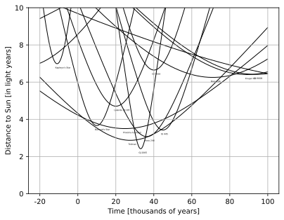
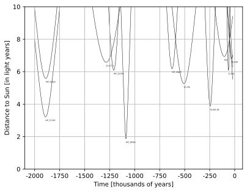
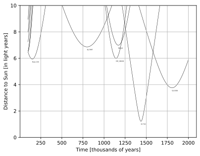

## About project


This repository contains the code for reproducing classic result from stellar kinematics.
Code uses HYG star database (110K stars!) in order to obtain rectangular coordinates and velocity vectors.
Also this repository is notable example of pretty mathematics and datascience.

## How to use
Find HYG .csv dataset and place it in the same folder. Then run (details are in the code):
```
python3 find_nearest_stars.py
```
One can also use this code for any dataset with computed rectangular coordinates and velocities.
In function 
```
def find(star_table, upper_bound=7.0):
    ...
```
units inside _star\_table_ pandas dataframe should be translated to _light years_ for coordinates and _light years per century_ for velocities. As required minimum, it should contain columns: _'x', 'y', 'z', 'vx', 'vy', 'vz'_ for computations and _'proper'_ column with star names. Then use it as follows:
```
stars = find(stars_table, upper_bound) 
draw_interval(stars, t_start, t_end, label, ...)
```

## A bit of mathematics
Lets choose rectangular coordinate system with center in the sun.
Stellar velocity vectors are considered constant.

Then distance to the sun from any star with position $(P,Q,R)$ and vector velocity $(A, B, C)$ 
in our linear model is given by

$$d = \sqrt{(P+A \cdot t)^2 + (Q+B \cdot t)^2 + (R+C \cdot t)^2}.$$

This equation is actually a upper branch of _hyperbola_ in $(t, d)$-coordinates, since equation
$$d^2 - (A^2 + B^2 + C^2) \cdot t^2 - 2 \cdot (A \cdot P + B \cdot Q + C \cdot R) \cdot t = P^2 + Q^2 + R^2$$

is equivalent to

$$d^2 - (\sqrt{A^2 + B^2 + C^2} \cdot t + \frac{A \cdot P + B \cdot Q + C \cdot R}{\sqrt{A^2 + B^2 + C^2}})^2 = (P^2 + Q^2 + R^2) - \frac{(A \cdot P + B \cdot Q + C \cdot R)^2}{A^2 + B^2 + C^2}$$

by "extracting the square" trick.

Last formula means that $d$ is minimized when 
$$t = -\frac{A \cdot P + B \cdot Q + C \cdot R}{A^2 + B^2 + C^2}.$$

Given star positions and velocities, let's use this expression for testing.

> It is easy to prove (by Cauchy-Schwarz inequality) $$(P^2 + Q^2 + R^2) - \frac{(A \cdot P + B \cdot Q + C \cdot R)^2}{A^2 + B^2 + C^2} \geq 0$$ and verify that our formula for distance is always upper branch of hyperbola for $(P, Q, R) \neq (0, 0, 0)$ and $(A, B, C) \neq (0, 0, 0)$ in general case when sun does not meet with other star on trajectory.

## Results
For HYG star database program had found 29 stars with minimum achieved distances less than 7 light years:
```
Proxima Centauri : d = 3.50 for t = 24.8 * 10^3 years
Toliman : d = 2.87 for t = 27.6 * 10^3 years
Barnard's Star : d = 3.66 for t = 10.0 * 10^3 years
Lalande 21185 : d = 4.71 for t = 20.0 * 10^3 years
Gl 65B : d = 6.80 for t = -29.7 * 10^3 years
Ross 154 : d = 5.93 for t = 149.9 * 10^3 years
Ross 248 : d = 3.07 for t = 36.3 * 10^3 years
Ran : d = 6.94 for t = -104.8 * 10^3 years
Ross 128 : d = 6.25 for t = 71.0 * 10^3 years
Kapteyn's Star : d = 6.99 for t = -10.9 * 10^3 years
Kruger 60 : d = 6.41 for t = 89.2 * 10^3 years
Gl 860B : d = 6.41 for t = 93.8 * 10^3 years
Gl 445 : d = 3.42 for t = 44.8 * 10^3 years
Gl 783A : d = 6.65 for t = 40.1 * 10^3 years
GJ 2097 : d = 6.86 for t = 798.9 * 10^3 years
GJ 2005 : d = 2.42 for t = 33.1 * 10^3 years
Gl 358 : d = 6.08 for t = -62.7 * 10^3 years
Gl 208 : d = 5.26 for t = -507.7 * 10^3 years
GJ 3106 : d = 3.76 for t = 1806.1 * 10^3 years
Gl 620.1B : d = 3.87 for t = -245.4 * 10^3 years
Wasat : d = 6.98 for t = 1169.2 * 10^3 years
Gl 710 : d = 1.22 for t = 1437.7 * 10^3 years
Gl 217.1 : d = 6.58 for t = -1284.9 * 10^3 years
HIP_38228 : d = 5.99 for t = 1142.3 * 10^3 years
HIP_30067 : d = 6.18 for t = -626.2 * 10^3 years
HIP_21158 : d = 3.21 for t = -1891.1 * 10^3 years
HIP_26624 : d = 5.58 for t = -1889.2 * 10^3 years
HIP_25240 : d = 6.09 for t = -1209.2 * 10^3 years
HIP_38965 : d = 1.87 for t = -1087.8 * 10^3 years
```




Star Gl 710 will approach the sun as close as 1.21 ly in 1.437 million years.
Star with HIP identifier 38965 had minimum distance 1.86 ly 1.087 million years ago.

Also program found a star GJ 2005 with achieved minimum distance 2.41 ly in 30 000 years from now.
For compare current minimum distance is about 4 light years for Proxima Centauri.
