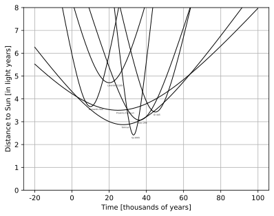
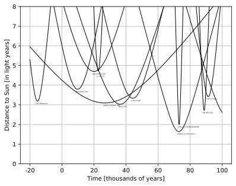
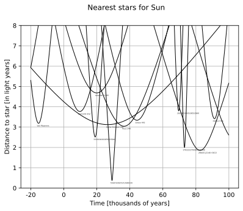
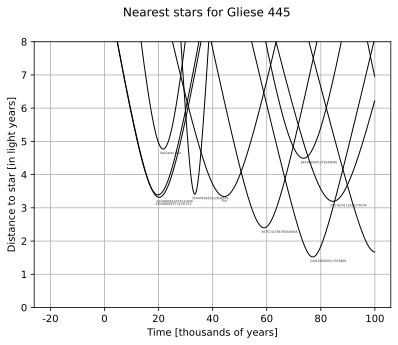
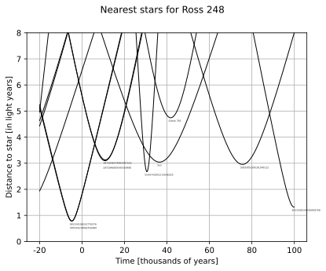

## About project
This repository contains the code for reproducing classic result from stellar kinematics: computed distances from the nearest stars to the solar system.

In experiments three main datasets with rectangular coordinates and stellar velocity vectors were used:
- HYG star database (110K stars), contains data from Hipparcos, Yale Bright Star and Gliese catalogues, includes distant stars;
- VizieR J/A+A/649/A6, GCNS star database (330K stars), from "Gaia Catalogue of Nearby Stars", contains stars from Gaia EDR3 within 100 parsec radius from the solar system;
- VizieR I/363, recent dataset (**31M stars**) from "Cartesian catalog of 30 million Gaia sources" article,
contains stars from Gaia DR3 with *well-defined* radial velocities (>92.5% of known). For this work, one need to concatenate partitions into one .csv file (and drop some columns from initial dataset, we are interested only in Gaia ID, position, velocity and distance), approximately 5Gb in size. 

## A bit of mathematics
### Simple proof
Lets choose rectangular coordinate system with center in the sun.
Stellar velocity vectors are considered constant.

Then distance to the sun from any star with position $(P, Q, R)$ and vector velocity $(A, B, C)$ 
in our linear model is given by

$$d = \sqrt{(P+A \cdot t)^2 + (Q+B \cdot t)^2 + (R+C \cdot t)^2}.$$

This equation is actually a upper branch of _hyperbola_ in $(t, d)$-coordinates, since equation
$$d^2 - (A^2 + B^2 + C^2) \cdot t^2 - 2 \cdot (A \cdot P + B \cdot Q + C \cdot R) \cdot t - (P^2 + Q^2 + R^2) = 0$$

is equivalent to

$$d^2 - (\sqrt{A^2 + B^2 + C^2} \cdot t + \frac{A \cdot P + B \cdot Q + C \cdot R}{\sqrt{A^2 + B^2 + C^2}})^2 = (P^2 + Q^2 + R^2) - \frac{(A \cdot P + B \cdot Q + C \cdot R)^2}{A^2 + B^2 + C^2}$$

by "extracting the square" trick.

Last formula also means that $d$ is minimized when 
$$t_{min} = -\frac{A \cdot P + B \cdot Q + C \cdot R}{A^2 + B^2 + C^2}.$$

> It is easy to prove (by Cauchy-Schwarz inequality) that $(P^2 + Q^2 + R^2) - \frac{(A \cdot P + B \cdot Q + C \cdot R)^2}{A^2 + B^2 + C^2}$ is non-negative and verify that our formula for distance is always upper branch of hyperbola for non-zero velocity in general case when sun does not meet with other star on trajectory.

### General solution
Let's rewrite similar logic using vectors in general case for pair of stars with positions $\bar{p}_t, \bar{q}_t$ 
and velocities $\bar{v}_p, \bar{v}_q$:
$$ d^2 = ||\bar{p}_t - \bar{q}_t||^2,$$
where $\bar{p}_t = \bar{p}_0 + \bar{v}_p \cdot t$ and $\bar{q}_t = \bar{q}_0 + \bar{v}_q \cdot t$.
Then it is easy to rewrite expression for $d^2$ in terms of relative position and speed: 
$$ d^2 = ||(\bar{p}_0 - \bar{q}_0) + (\bar{v}_p - \bar{v}_q) \cdot t||^2 = ||\bar{p}_{rel} + \bar{v}_{rel} \cdot t||^2.$$

This expression reminds the case from previous paragraph. 
The derivative
$$(||\bar{p}_{rel} + \bar{v}_{rel} \cdot t||^2)' = 2 \cdot (||\bar{v}_{rel} ||^2 \cdot t + \langle \bar{p}_{rel}, \bar{v}_{rel} \rangle) $$
is equal zero when $$t = -\frac{\langle \bar{p}_{rel}, \bar{v}_{rel} \rangle}{||\bar{v}_{rel} ||^2}$$
and that perfectly coincides with initial proof.

Given star *positions* and *velocities*, let's use this expression for testing.

## Example
Find HYG .csv dataset and place it in the same folder. 
```python
if __name__ == '__main__':
    HYG_experiment('./HYG.csv')
    # GCNS_experiment_with_patch('./GCNS.csv')
```
Then run (details are in the code):
```
python3 run_experiment.py
```
One can also use this code for any dataset with computed rectangular coordinates and velocities.

## How to use in code
With a little preparation project code will work with any offered dataset.
In function 
```python
def find(star_table, upper_bound=5.0):
    ...
```
input pandas dataframe should have columns: **x, y, z, vx, vy, vz** for computations and **proper** column with star identifiers (for example, GL, HIP, Gaia ID, 2MASS or common name). You can choose any type of data to identify the star or even mix different types in one column, however it should contain one necessary row for Sun with zero coordinates and velocities.

| proper         | x   | y  | z  | vx  | vy  | vz  |
| -------        | ----|----|----|---- |---- |---- |
|   Sun          | 0   | 0  | 0  | 0   | 0   | 0   |
|Gliese 445      | ... |    |    |     |     |     |
|2MASS J2146+3813| ... |    |    |     |     |     |

And units inside _star\_table_ dataframe should be translated to _light years_ for coordinates and _light years per century_ for velocities

Use it in your code as follows:
```python
stars = find(stars_table, upper_bound) 
draw_interval(stars, t_start, t_end, label, ...) # time should be in thousands of years
```
This will print stars with $t_{min}, d_{min}$ and draw a picture with distances.

## How to restore velocity vectors [GCNS data]
Unfortunately, 75% of stars in GCNS data do not have vector velocity (including Barnard's star, one of the nearest to our solar system).
However, the data contains columns with measured right ascention, declination, proper motions and more. 

If $(\alpha, \delta, \pi)$ data was given and proper motions $\mu_{\delta}, \mu_{\alpha^*}$ with radial velocity $v_r$ was measured, then velocity vector in Galactic coordinate system can be computed as follows (see *mini_star_lib.py* for details):
```python
def get_uvw(star_info):
    alpha = star_info['RAdeg'] * (np.pi / 180)
    delta, omega = star_info['DEdeg'] * (np.pi / 180), star_info['Plx']
    mu_a, mu_d, vr  = star_info['pmRA'], star_info['pmDE'], star_info['RV']
    
    v = [speed_to_kms * mu_a / omega, speed_to_kms * mu_d / omega, vr ]
    A_G_t = np.array(N_B) @ np.array(X_0)
    A = [[-np.sin(alpha), -np.sin(delta)*np.cos(alpha)  , np.cos(delta)*np.cos(alpha) ],
         [np.cos(alpha) , -np.sin(delta)*np.sin(alpha)  , np.cos(delta)*np.sin(alpha) ],
         [0             ,  np.cos(delta)                , np.sin(delta)               ]]
    return A_G_t @ np.array(A) @ np.array(v)
```
The main problem is that RV is often missed together with vector velocity (which is logical).
That means dataset should be patched with RV values in order to get more stars for our experiment.

In experiment, _sosdr1.csv_ data from "Survey of surveys I" (11 541 195 stars) and _'rvstdcat.csv'_ dataset (4 813 stars) with averaged $v_r$ from "Gaia DR2 radial velocity standard stars catalog" was used. Unfortunately, that procedure fixed only ~2% of initial data. 

## Results (HYG data)
For HYG star database program had found 12 stars with minimum achieved distances $\rho \leq 5.0$ light years.



As an interesting fact, program found a star GJ 2005 with achieved minimum distance 2.42 ly in just 30 000 years from now.
For comparison current minimum distance is about 4.25 light years for Proxima Centauri.

## Results (GCNS data)
Results for GCNS data are expected to be more precize. 
Difference can be seen, for example, by estimates for famous Gl 710 star.
HYG data usage lead to minimal distance estimate equal to 1.22 ly in 1.437 million years. 
However, GCNS data leads to estimate 0.17 ly for in 1.282 million years.



For augmented version of GCNS dataset this program had found 44 stars with minimum achieved distances $\rho \leq 5.0$ light years.

## Results (VizieR I/363 data, Gaia DR3 with known radial velocities)


For augmented version of VizieR I/363 dataset this program had found 264 stars with minimum achieved distances $\rho \leq 5.0$ light years.

## More features
With this code it is possible to compute similar trajectories for any star with known position and velocity.
```python
def GAIA_DR3_experiment_with_patch(path_to_GAIA, central_star_name='Sun'):
```
List of available options is stored in dictionary *Gaia_EDR3_ID_to_common* from *mini_star_lib.py*.


